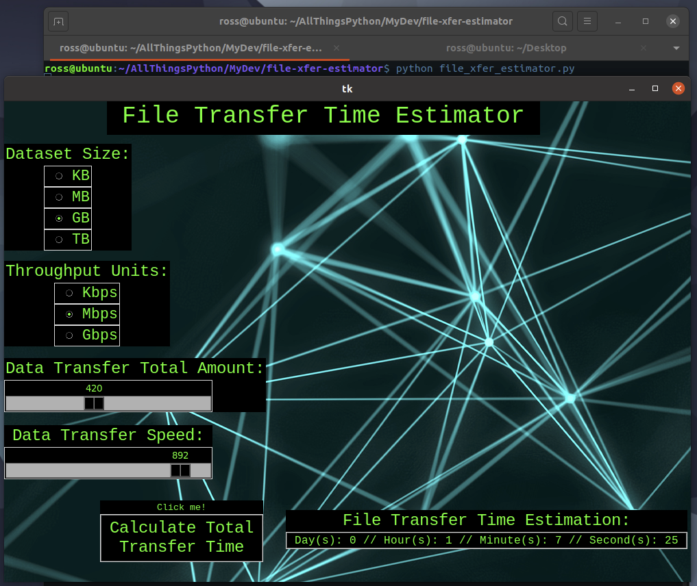

#FileXferEstimator
> GUI program that estimates time it will take to transfer a set amount of data at given speed.

Python GUI app built off of Tkinter that generates a time estimation to transfer a specific amount of data at a given transfer speed. Dataset size can be customized for Kilobytes, Megabytes, Gigabytes or Terabytes. Throughput units can be customized to be measured in Kbps, Mbps or Gbps. 



## Environment Setup
1. Install Python (Linux-oriented)  
```$ sudo apt-get update```  
```$ sudo apt-get install python3.8```  

2. Set up virtual environment (recommended, not required)  
*Version/path dependent on your Python installation*  
```sudo apt-get install python3-pip```  
```pip install virtualenv```  
```python3 -m venv env```  

3. Activate virtual environment from working directory in repository  
```source env/bin/activate```  

4. Install required packages via pip  
```pip install -r requirements.txt```  

## Running the application  
```python file_xfer_estimator.py```  

<!-- Markdown link & img dfn's -->
[chrome]: https://chromedriver.chromium.org/getting-started

